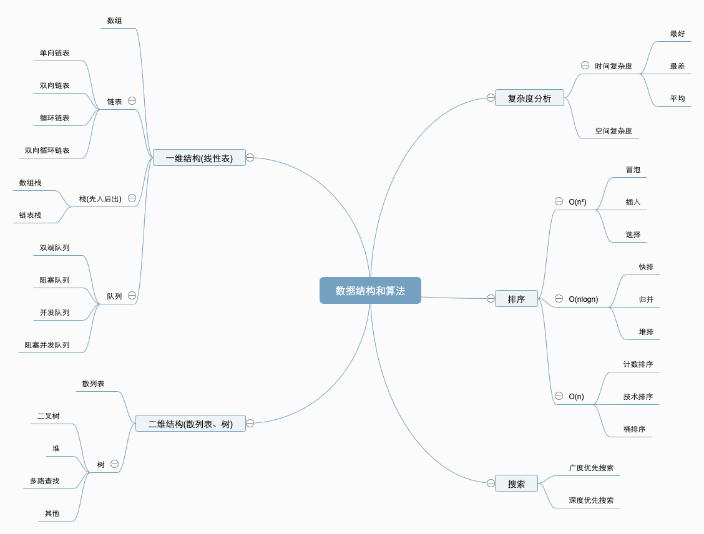

# 学习笔记

# 关于时间复杂度
常见的时间复杂度有O(1)O(logn)O(n)O(nlogn)O(n²)
其中时间复杂度又分为'最差时间复杂度'、最好时间复杂度和平均时间复杂度，
对应同一个算法下不同情况

# 关于空间复杂度
空间复杂度中O(1)的复杂度也称为原地算法，指的是只需要常量级的临时空间，比如冒泡排序等

# 算法的稳定性
稳定性是指算法是否会改变原有相同数据的顺序

# 数据算法脑图
