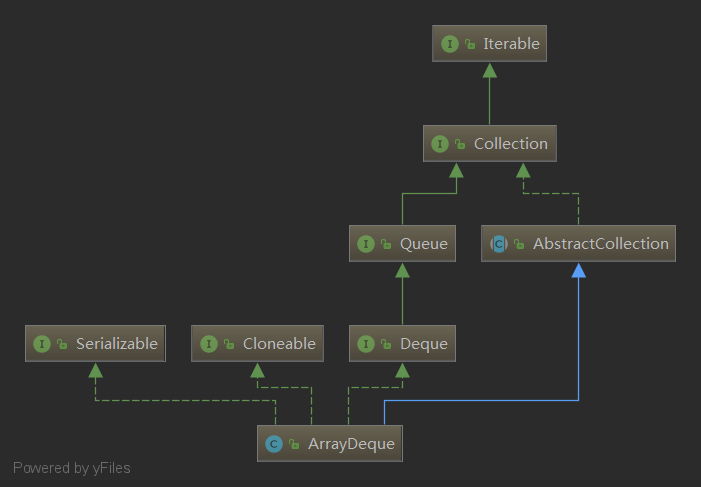

# 学习笔记

## Dequeue 源码分析
### 基于数组的双端队列源码分析
### 问题
1. 什么是双端队列(double-ended queue)？
2. 如何使用数组实现双端队列？
3. 数组双端队列是否是线程安全的？
4. 数组双端队列是否是有界的？  

### 简单介绍
双端队列是一种特殊的队列。元素可以在这个队列的两端进行进出操作，所以叫双端队列。  
  
数组双端队列是以数组的方式实现，它是非线程安全的。  
### 继承

    
    public interface Deque<E> extends Queue<E> {
        // Add elements to the queue head
        void addFirst(E e);
        // Add elements to the end of the queue
        void addLast(E e);
        // Add elements to the queue head
        boolean offerFirst(E e);
        // Add elements to the end of the queue
        boolean offerLast(E e);
        // Remove elements from the queue head
        E removeFirst();
        // Remove elements from the end of the queue
        E removeLast();
        // Remove elements from the queue head
        E pollFirst();
        // Remove elements from the end of the queue
        E pollLast();
        // View Queue Header Elements
        E getFirst();
        // Look at the end of the queue element
        E getLast();
        // View Queue Header Elements
        E peekFirst();
        // Look at the end of the queue element
        E peekLast();
        // Remove the specified element from the queue head by traversing backwards
        boolean removeFirstOccurrence(Object o);
        // Remove the specified element by traversing forward from the end of the queue
        boolean removeLastOccurrence(Object o);
    
        // Method in the *** Queue ***
        
        // Add element, equal to addLast(e)
        boolean add(E e);
         // Add element, equal to offer Last (e)
        boolean offer(E e);
        // Remove the element, equal to removeFirst()
        E remove();
        // Remove the element, equal to pollFirst()
        E poll();
        // View the element, equal to getFirst()
        E element();
        // View the element, equal to peekFirst()
        E peek();
    
        // *** Stack Method***
    
        // On the stack, equal to addFirst(e)
        void push(E e);
        // Out of the stack, equal to removeFirst()
        E pop();
    
        // Method in *** Collection ***
        
        // Delete the specified element, equal to removeFirstOccurrence(o)
        boolean remove(Object o);
        // Check whether an element is included
        boolean contains(Object o);
        // Element number
        public int size();
        // iterator
        Iterator<E> iterator();
        // reverse iterator
        Iterator<E> descendingIterator();
    }

以下方法已经添加到Dequeue中：
1. *First,在队列的头部操作元素;
2. *Last,在队列的尾部操作元素;
3. push(e), pop(),通过栈来操作元素;

## 源代码分析
### 主属性
    
    // An array of storage elements
    transient Object[] elements; // non-private to simplify nested class access
    // Queue head position
    transient int head;
    // Queue tail position
    transient int tail;
    // Minimum initial capacity
    private static final int MIN_INITIAL_CAPACITY = 8;
    
从这些属性我们可以了解到ArrayDeqe使用数组来存储元素和使用首尾指针确定队列的首和尾，数组的最小容量为8.
### 主方法
    
    // Default construction method with initial capacity of 16
    public ArrayDeque() {
        elements = new Object[16];
    }
    // Initialization of specified number of elements
    public ArrayDeque(int numElements) {
        allocateElements(numElements);
    }
    // Initialize elements in set c into arrays
    public ArrayDeque(Collection<? extends E> c) {
        allocateElements(c.size());
        addAll(c);
    }
    // Initialize arrays
    private void allocateElements(int numElements) {
        elements = new Object[calculateSize(numElements)];
    }
    // Computing capacity, the logic of this code is to compute the closest n-th power greater than numElements and no less than 8
    // For example, 3 is 8, 9 is 16, 33 is 64.
    private static int calculateSize(int numElements) {
        int initialCapacity = MIN_INITIAL_CAPACITY;
        // Find the best power of two to hold elements.
        // Tests "<=" because arrays aren't kept full.
        if (numElements >= initialCapacity) {
            initialCapacity = numElements;
            initialCapacity |= (initialCapacity >>>  1);
            initialCapacity |= (initialCapacity >>>  2);
            initialCapacity |= (initialCapacity >>>  4);
            initialCapacity |= (initialCapacity >>>  8);
            initialCapacity |= (initialCapacity >>> 16);
            initialCapacity++;
    
            if (initialCapacity < 0)   // Too many elements, must back off
                initialCapacity >>>= 1;// Good luck allocating 2 ^ 30 elements
        }
        return initialCapacity;
    }

1. 元素有两个方法进入队列，从头部插入和从尾部插入；
2. 如果容量不够，数组容量将扩大一倍；
3. 通过模块化使首尾指针成环；
4. X & (len - 1) = x% len，使用起来更快；
### 容量扩充
    
    private void doubleCapacity() {
        assert head == tail;
        // Position of Head Pointer
        int p = head;
        // Old array length
        int n = elements.length;
        // The distance between the head pointer and the end of the array
        int r = n - p; // number of elements to the right of p
        // The new length is twice as long as the old one.
        int newCapacity = n << 1;
        // Judging whether or not spillover occurs
        if (newCapacity < 0)
            throw new IllegalStateException("Sorry, deque too big");
        // New Array
        Object[] a = new Object[newCapacity];
        // Copy the elements after the old array head into the new array
        System.arraycopy(elements, p, a, 0, r);
        // Copy the elements between the old array subscript 0 and head to the new array
        System.arraycopy(elements, 0, a, r, p);
        // Assignment to a new array
        elements = a;
        // head points to 0, tail points to the position represented by the length of the old array
        head = 0;
        tail = n;
    }
    
迁移的元素需要进行外接，下图更容易理解。

### 出队
我们可以使用pollFirst()和pollLast()方法实现出队.
    
    // Out of the queue
    public E pollFirst() {
        int h = head;
        @SuppressWarnings("unchecked")
        // Take the queue head element
        E result = (E) elements[h];
        // If the queue is empty, return null
        if (result == null)
            return null;
        // Leave the queue empty
        elements[h] = null;     // Must null out slot
        // Queue head pointer moved one bit to the right
        head = (h + 1) & (elements.length - 1);
        // Returns the element obtained
        return result;
    }
    // Get out of line at the end of the queue
    public E pollLast() {
        // Tail pointer moved one bit to the left
        int t = (tail - 1) & (elements.length - 1);
        @SuppressWarnings("unchecked")
        // Take the element at the current tail pointer
        E result = (E) elements[t];
        // Return null if the queue is empty
        if (result == null)
            return null;
        // Dispose the current tail pointer to null
        elements[t] = null;
        // Tail points to the new tail pointer
        tail = t;
        // Returns the element obtained
        return result;
    }

1. 有两个方法可以实现出队操作，从头部出队和从尾部出队；
2. 通过模块化使数组的首尾指针成环；
3. 元素出队后数组的大小并不会缩小；

## 栈
Deque可以直接作为栈来使用，那么Array Deque是如何工作的呢？
    
    public void push(E e) {
        addFirst(e);
    }
    
    public E pop() {
        return removeFirst();
    }
只要使用队列的首部方法就可以实现栈的功能，是不是很简单呢？
## 总结
1. Array Deque是一个用数组实现的双端队列。
2. Array Deque的进队操作是通过使用首尾指针完成的。
3. 当Array Deque的容量不够的时候，它将自动扩容，每次扩容后的容量为之前的两倍。
4. Array Deque可以直接作为栈使用。

## 学习总结
这周学习的内容数组、链表、跳表、栈、队列、优先队列、双端队列。相比于算法知识点的学习，关于算法的学习方法更值得我们学习。

## 第一刷题方法：  
1. 题目看3遍；
2. 思考5分钟，列出能想到的所有方法；想不出来直接看答案（国内站+国际站）即可。
3. 开始手撸代码，一点都不会的话直接背。
4. 分析解法的时间复杂度和空间复杂度。
5. 比较各种解法优劣和使用场景。

## 找重复性
算法的练习不会涉及到业务，所以我们用到的流程就3个：  
1. if-else;  
2. for、while、loop;  
3. recursion(递归).  

这么一想的话解法主要集中在判断和找重复性。找重复性、找重复性、找重复性就变成解题的关键。

## 懵逼的时候怎么办？  
1. 暴力求解
2. 分析基本情况，可以使用特殊值枚举几个情况找规律；  
3. 根据枚举的基本情况找重复性，找最近重复子问题，进而找思路。  
4. 同时可以考虑升维和空间换时间的方法。  

## 心得  
常见的套路需要记忆，日常练习很重要、日常练习很重要、日常练习很重要，就跟练武练基本功，基本的编程技能和常见题型的套路要形成肌肉记忆.  

1. 找到正确的方法
2. 将目标拆分成可执行的步骤、小目标
3. 刻意练习
4. 及时反馈
5. 对反馈的问题进行调整和可以练习
6. 重复3-5

