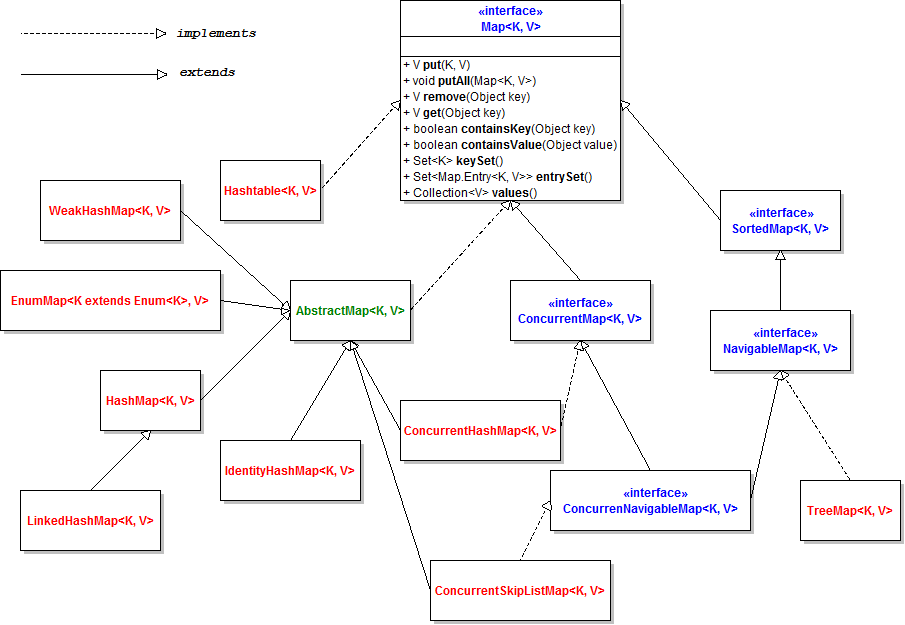
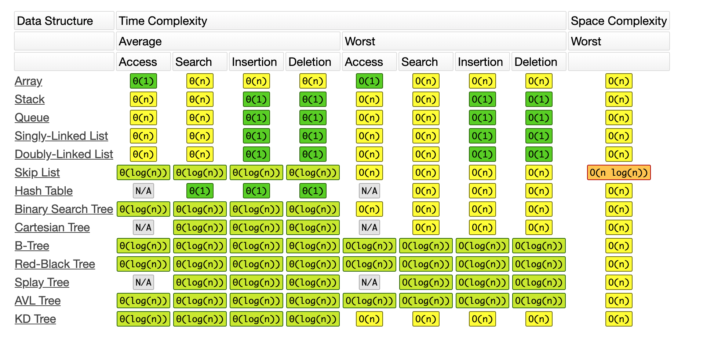

Week2学习笔记-No.0291

# Lesson5 哈希表、映射、集合


## 1 HashMap
- Key和Value都允许为空，Key重复会覆盖，Value允许重复，遍历是无序的；
- HashMap非线程安全，替代方案是使用ConcurrentHashMap或Collections.synchronizedMap;
- jdk1.8之前使用数组+链表实现，jdk1.8开始改进为**数组+链表+红黑树**，当链表长度超过阈值时将链表结构转换为红黑树结构，减少hash冲突时的查找时间，当链表长度减少到阈值时会由由红黑树转换为链表形式，用于减少存储空间；
- jdk1.8中（下同）链表结点 Node为单链表结构(LinkedList是双向链表), 红黑树结点是 TreeNode;
```java
static class Node<K,V> implements Map.Entry<K,V> {
        final int hash;
        final K key;
        V value;
        Node<K,V> next;

        Node(int hash, K key, V value, Node<K,V> next) {
            this.hash = hash;
            this.key = key;
            this.value = value;
            this.next = next;
        }
        // ...
}
```
```java
 static final class TreeNode<K,V> extends LinkedHashMap.Entry<K,V> {
        TreeNode<K,V> parent;  // red-black tree links
        TreeNode<K,V> left;
        TreeNode<K,V> right;
        TreeNode<K,V> prev;    // needed to unlink next upon deletion
        boolean red;
        TreeNode(int hash, K key, V val, Node<K,V> next) {
            super(hash, key, val, next);
        }
        // ...
}
```
- 属性字段
```java
public class HashMap<K,V> extends AbstractMap<K,V>
    implements Map<K,V>, Cloneable, Serializable {

    /**
     * 数组的初始容量为2^4
     * 注意：这里必须是2的幂次方，因为元素的位置下标是通过&与操作实现的，
     *      如果不是2的幂次方，计算出来的数组下标可能是错的。
     */
    static final int DEFAULT_INITIAL_CAPACITY = 1 << 4; // aka 16

    /**
     * 数组的最大容量为 2^30 
     */
    static final int MAXIMUM_CAPACITY = 1 << 30;

    /**
     * 默认的装载因子
     */
    static final float DEFAULT_LOAD_FACTOR = 0.75f;

    /**
     * 链表转换为红黑树的阈值为8
     */
    static final int TREEIFY_THRESHOLD = 8;

    /**
     * 红黑树转换为链表的阈值 TODO 为何二者大小不同？
     */
    static final int UNTREEIFY_THRESHOLD = 6;

    /**
     * 数组中bin可以转换为红黑树的最小容量
     * 避免如下情形：
     *  如果数组很小导致的bin中链表元素过多，此时需要resize哈希表，而不是直接变成树（treeify);
     */
    static final int MIN_TREEIFY_CAPACITY = 64;
    
    /**
     * 哈希表，即Node数组，数组中的每个元素都是1个单链表
     */
    transient Node<K,V>[] table;

    /**
     * 存储key集合
     */
    transient Set<Map.Entry<K,V>> entrySet;

    /**
     * 元素数目
     */
    transient int size;

    /**
     * HashMap数据结构的修改次数，用于fail-fast机制
     */
    transient int modCount;

    /**
     * 数组需要resize的阈值，默认为 capacity * loadFactor = 16 * 0.75 =12
     */
    int threshold;

    /**
     * 装载因子
     */
    final float loadFactor;
    // ...
}
```
- 常用方法
```java
public class HashMap<K,V> extends AbstractMap<K,V>
    implements Map<K,V>, Cloneable, Serializable {
    /**
    * 构造函数，初始化装载因子
    */
    public HashMap() {
        this.loadFactor = DEFAULT_LOAD_FACTOR; // all other fields defaulted
    }

    /**
     * 数据插入
     */
    public V put(K key, V value) {
        return putVal(hash(key), key, value, false, true);
    }
    /**
     * Implements Map.put and related methods
     *
     * @param hash hash for key
     * @param key the key
     * @param value the value to put
     * @param onlyIfAbsent if true, don't change existing value
     * @param evict if false, the table is in creation mode.
     * @return previous value, or null if none
     */
    final V putVal(int hash, K key, V value, boolean onlyIfAbsent,
                   boolean evict) {
        Node<K,V>[] tab; Node<K,V> p; int n, i;
        // 数组为空，使用resize初始化
        if ((tab = table) == null || (n = tab.length) == 0)
            n = (tab = resize()).length;
        // 根据hash值找到存储的数组下标，为null表示该位置没有元素，直接生成节点存入即可
        if ((p = tab[i = (n - 1) & hash]) == null)
            tab[i] = newNode(hash, key, value, null);
        else {
            // hash code冲突的情况
            Node<K,V> e; K k;
            
            // [C1] 待插入key和bin里的第一个结点的key相同，e指向第一个节点
            if (p.hash == hash &&
                ((k = p.key) == key || (key != null && key.equals(k))))
                e = p;
            // [C2] bin里的第一结点是树节点，将结点插入红黑树中
            else if (p instanceof TreeNode)
                e = ((TreeNode<K,V>)p).putTreeVal(this, tab, hash, key, value);
            else {
            // [C3] 即不是链表中的第一个节点也不是树节点，
                /*
                 * 遍历链表：
                 * （1）如果存在相同的key，则e指向已存在的节点；
                 * （2）否则，插入链表的尾部；（这里需要判断插入新结点后链表的长度是否需要treeify）
                 */
                for (int binCount = 0; ; ++binCount) {
                    if ((e = p.next) == null) {
                        p.next = newNode(hash, key, value, null);
                        if (binCount >= TREEIFY_THRESHOLD - 1) // -1 for 1st
                            treeifyBin(tab, hash);
                        break;
                    }
                    if (e.hash == hash &&
                        ((k = e.key) == key || (key != null && key.equals(k))))
                        break;
                    
                    p = e;
                }
            }
            // e 不为空表示存在和待插入key相同的结点
            if (e != null) { // existing mapping for key
                V oldValue = e.value;
                // onlyIfAbsent为true表示不覆盖，默认是false即会被新的value覆盖
                if (!onlyIfAbsent || oldValue == null)
                    e.value = value;
                // 和红黑树有关的一些回调函数
                afterNodeAccess(e);
                return oldValue;
            }
        }
        // 记录一次HashMap的结构修改
        ++modCount;
        // 查看是否达到阈值需要resize
        if (++size > threshold)
            resize();
        // 和红黑树有关的一些回调函数
        afterNodeInsertion(evict);
        return null;
    }

    /**
     * Initializes or doubles table size. 
     */
    final Node<K,V>[] resize() {
        Node<K,V>[] oldTab = table;
        int oldCap = (oldTab == null) ? 0 : oldTab.length;
        int oldThr = threshold;
        int newCap, newThr = 0;
        if (oldCap > 0) {
            if (oldCap >= MAXIMUM_CAPACITY) {
                threshold = Integer.MAX_VALUE;
                return oldTab;
            }
            else if ((newCap = oldCap << 1) < MAXIMUM_CAPACITY &&
                     oldCap >= DEFAULT_INITIAL_CAPACITY)
                newThr = oldThr << 1; // double threshold
        }
        else if (oldThr > 0) // initial capacity was placed in threshold
            newCap = oldThr;
        else {               // zero initial threshold signifies using defaults
            newCap = DEFAULT_INITIAL_CAPACITY;
            newThr = (int)(DEFAULT_LOAD_FACTOR * DEFAULT_INITIAL_CAPACITY);
        }
        if (newThr == 0) {
            float ft = (float)newCap * loadFactor;
            newThr = (newCap < MAXIMUM_CAPACITY && ft < (float)MAXIMUM_CAPACITY ?
                      (int)ft : Integer.MAX_VALUE);
        }
        threshold = newThr;
        @SuppressWarnings({"rawtypes","unchecked"})
            Node<K,V>[] newTab = (Node<K,V>[])new Node[newCap];
        table = newTab;
        if (oldTab != null) {
            for (int j = 0; j < oldCap; ++j) {
                Node<K,V> e;
                if ((e = oldTab[j]) != null) {
                    oldTab[j] = null;
                    if (e.next == null)
                        newTab[e.hash & (newCap - 1)] = e;
                    else if (e instanceof TreeNode)
                        ((TreeNode<K,V>)e).split(this, newTab, j, oldCap);
                    else { // preserve order
                        Node<K,V> loHead = null, loTail = null;
                        Node<K,V> hiHead = null, hiTail = null;
                        Node<K,V> next;
                        do {
                            next = e.next;
                            if ((e.hash & oldCap) == 0) {
                                if (loTail == null)
                                    loHead = e;
                                else
                                    loTail.next = e;
                                loTail = e;
                            }
                            else {
                                if (hiTail == null)
                                    hiHead = e;
                                else
                                    hiTail.next = e;
                                hiTail = e;
                            }
                        } while ((e = next) != null);
                        if (loTail != null) {
                            loTail.next = null;
                            newTab[j] = loHead;
                        }
                        if (hiTail != null) {
                            hiTail.next = null;
                            newTab[j + oldCap] = hiHead;
                        }
                    }
                }
            }
        }
        return newTab;
    }
    // ...
}
```
-  [HashMap在多线程环境下会引发的死循环问题；](https://www.cnblogs.com/xrq730/p/5037299.html)

## 2 LinkedHashMap
- LinkedHashMap 保证了遍历是有序的，即和元素的插入顺序一致；
- LinkedHashMap 继承自HashMap，区别在于新增了before和after，用于维护插入的先后顺序：
```java
public class LinkedHashMap<K,V>
    extends HashMap<K,V>
    implements Map<K,V>
{

    /**
     * HashMap.Node subclass for normal LinkedHashMap entries.
     */
    static class Entry<K,V> extends HashMap.Node<K,V> {
        Entry<K,V> before, after;
        Entry(int hash, K key, V value, Node<K,V> next) {
            super(hash, key, value, next);
        }
    }

    /**
     * The head (eldest) of the doubly linked list.
     */
    transient LinkedHashMap.Entry<K,V> head;

    /**
     * The tail (youngest) of the doubly linked list.
     */
    transient LinkedHashMap.Entry<K,V> tail;

    /**
     * 遍历顺序，默认为元素的插入顺序即false
     */
    final boolean accessOrder;
    // ...
}
```

## 3 HashTable
- HashTable的key和value都不允许为null；
- HashTable是线程安全的，因为对外方法都使用了synchronized；
- jdk源码中已经说明HashTable不建议使用，考虑线程安全时建议使用并发性更高的ConcurrentHashMap；


## 4 刷题实战
- 题目列表：
   - https://leetcode.com/problems/valid-anagram/
   - https://leetcode.com/problems/group-anagrams/
   - https://leetcode.com/problems/two-sum/
- 解题思路总结：
    - 异位词有两种解决方案，一种使用HashMap的key来记录异位词，另一种是用HashMap的key来记录异位词26个字母出现的次数组成的string；
    - twoSum的基本方法是暴力求解，使用HashMap记录每个元素是否存在哈希表中，遍历时如果target-遍历元素的值已经存在，说明找到了一对和；

----
# Lesson6 树、二叉树、二叉搜索树
## 1 二叉树
- 二叉树的遍历：前序、中序、后序；
- 树本身的定义是递归的，各种树的操作也是使用递归实现；

## 2 二叉搜索树
- 二叉搜索树，左子树 < 根节点 < 右子树；
- 二叉搜索树的遍历是升序遍历，即遍历后的元素值是升序的；
- 二叉搜索树查询/插入/删除操作的时间复杂度都是 O(log N);
- [二叉搜索树可视化](https://visualgo.net/zh/bst);

## 3 刷题实战
- 题目列表：
    - https://leetcode-cn.com/problems/binary-tree-inorder-traversal/
    - https://leetcode-cn.com/problems/binary-tree-preorder-traversal/
    - https://leetcode-cn.com/problems/n-ary-tree-postorder-traversal/
    - https://leetcode-cn.com/problems/n-ary-tree-preorder-traversal/
    - https://leetcode-cn.com/problems/n-ary-tree-level-order-traversal/

- 解题思路总结：
    - 递归和迭代，迭代手动维护一个栈略复杂；

---
# Lesson7 泛型递归、树的递归
## 1 Java递归模板
```
public void recur(int level, int param) { 
      // 递归终止条件
      if (level > MAX_LEVEL) { 
        // process result 
        return; 
      } 
    
      // 处理当前层的逻辑
      process(level, param); 
    
      // 下探到下一层 
      recur( level: level + 1, newParam); 
    
      // 清理当前层 
}
```

## 2 递归思维养成要点
- 不要人肉递归，即不要养成绘制递归树的方法，要抛弃这种思路；
- 找到最近重复子问题；
- 数学归纳法依次罗列问题，找到重复性；

## 3 刷题实战
- 题目列表：
    - https://leetcode-cn.com/problems/climbing-stairs/
    - https://leetcode-cn.com/problems/generate-parentheses/
    - https://leetcode-cn.com/problems/invert-binary-tree/description/
    - https://leetcode-cn.com/problems/validate-binary-search-tree
    - https://leetcode-cn.com/problems/maximum-depth-of-binary-tree
    - https://leetcode-cn.com/problems/minimum-depth-of-binary-tree
    - https://leetcode-cn.com/problems/serialize-and-deserialize-binary-tree/
    - https://leetcode-cn.com/problems/lowest-common-ancestor-of-a-binary-tree/
    - https://leetcode-cn.com/problems/construct-binary-tree-from-preorder-and-inorder-traversal
    - https://leetcode-cn.com/problems/combinations/
    - https://leetcode-cn.com/problems/permutations/
    - https://leetcode-cn.com/problems/permutations-ii/

- 解题思路总结：
    - 二叉树的题目都是三种遍历的应用，掌握递归遍历二叉树的套路即可；
    - 使用递归时直接套模板，考虑4个步骤中每一步要做的事情；

     
# 常用数据结构复杂度图表
