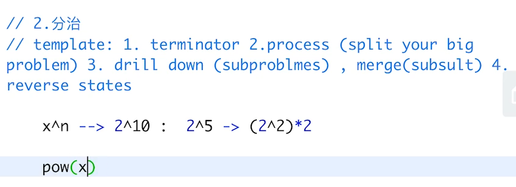
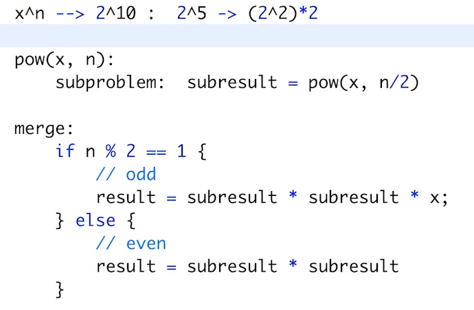
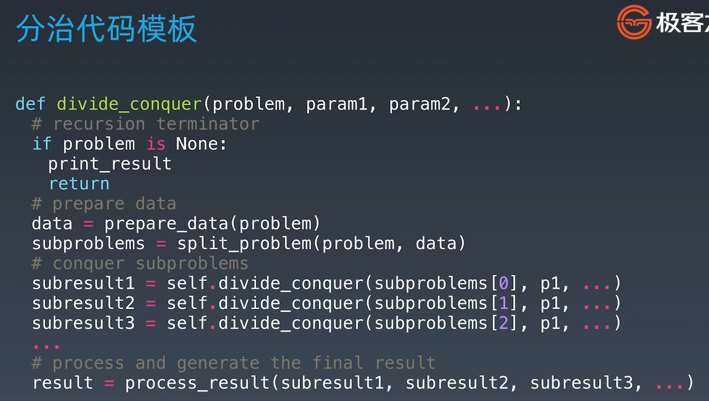

学习笔记
# 分治法模板
- 
- 

# 分治回溯 本质是递归
- 碰到题目找重复性

# 反复训练 精通
分治代码模板和递归代码模板一致  

最后多了一步 分治需要组合子结果，最后返回回去
问题进行分析，子结果如何合并
归去来兮的感觉

# 学习方法
不要死磕 重要的是过遍数
而不是每次花很长时间
照着我说的方法做

国际区题解
国际区高质量代码
时间复杂度
过遍数 实在不行背

# git ssh协议访问
yum install git
git clone ssh://root@107.173.137.248/root/gitbase.git
语法1:ssh://[<username>@]<server>[:<port>]/home/xxx/repo1.git
语法2:[<username>@]<server>:/home/xxx/repo1.git
注意:
SSH协议地址格式可以使用两种不同的写法，
第一种是使用ssh://开头的标准的SSH协议URL写法，
第二种是SCP格式的写法。

# 前三周算法复习

第三周

# 第8课 分治回溯
## 预习题目
1. https://leetcode-cn.com/problems/powx-n/
2. https://leetcode-cn.com/problems/subsets/
## 实战题目
1. https://leetcode-cn.com/problems/majority-element/description/
 （简单、但是高频）
2. https://leetcode-cn.com/problems/letter-combinations-of-a-phone-number/
3. https://leetcode-cn.com/problems/n-queens/

# 第9课 深度广度优先
## 实战题目
1. https://leetcode-cn.com/problems/binary-tree-level-order-traversal/#/description
2. https://leetcode-cn.com/problems/minimum-genetic-mutation/#/description
3. https://leetcode-cn.com/problems/generate-parentheses/#/description
4. https://leetcode-cn.com/problems/find-largest-value-in-each-tree-row/#/description

## homework
1. https://leetcode-cn.com/problems/word-ladder/description/
2. https://leetcode-cn.com/problems/word-ladder-ii/description/
3. https://leetcode-cn.com/problems/number-of-islands/
4. https://leetcode-cn.com/problems/minesweeper/description/

# 第10课 贪心
## homework
1. https://leetcode-cn.com/problems/lemonade-change/description/
2. https://leetcode-cn.com/problems/best-time-to-buy-and-sell-stock-ii/description/
3. https://leetcode-cn.com/problems/assign-cookies/description/
4. https://leetcode-cn.com/problems/walking-robot-simulation/description/ 
5. https://leetcode-cn.com/problems/jump-game/
https://leetcode-cn.com/problems/jump-game-ii/

# 第11课 二分
## 实战题目
1. https://leetcode-cn.com/problems/sqrtx/ 
https://www.beyond3d.com/content/articles/8/ （扩展阅读）
2. https://leetcode.com-cn/problems/valid-perfect-square/ 

## homework
1. https://leetcode-cn.com/problems/search-in-rotated-sorted-array/ 
2. https://leetcode-cn.com/problems/search-a-2d-matrix/
3. https://leetcode-cn.com/problems/find-minimum-in-rotated-sorted-array/

第二周

# 第7课 泛型递归，树的递归
## 实战a
1. https://leetcode-cn.com/problems/climbing-stairs/ 
2. https://leetcode-cn.com/problems/generate-parentheses/

## 实战b
1. https://leetcode-cn.com/problems/invert-binary-tree/description/  
2. https://leetcode-cn.com/problems/validate-binary
3. https://leetcode-cn.com/problems/maximum-depth-of-binary-tree 
4. https://leetcode-cn.com/problems/minimum-depth-of-binary-tree 
5. https://leetcode-cn.com/problems/serialize-and-deserialize-binary-tree/ 

## homework
1. https://leetcode-cn.com/problems/lowest-common-ancestor-of-a-binary-tree/
2. https://leetcode-cn.com/problems/construct-binary-tree-from-preorder-and-inorder-traversal
3. https://leetcode-cn.com/problems/combinations/
4. https://leetcode-cn.com/problems/permutations/ 
    https://leetcode-cn.com/problems/permutations-ii/

# 第6课 树 二叉树 搜索树
## 实战
1. https://leetcode-cn.com/problems/binary-tree-inorder-traversal/ 
2. https://leetcode-cn.com/problems/binary-tree-preorder-traversal/ 
3. https://leetcode-cn.com/problems/n-ary-tree-postorder-traversal/ 
4. https://leetcode-cn.com/problems/n-ary-tree-preorder-traversal/
5. https://leetcode-cn.com/problems/n-ary-tree-level-order-traversal/

# 第5课 哈希表 映射 集合
## 实战
1. https://leetcode-cn.com/problems/valid-anagram/description/   
2. https://leetcode-cn.com/problems/group-anagrams/ 
3. https://leetcode-cn.com/problems/two-sum/description/ 
小技巧 
养成收藏精选代码的习惯：https://shimo.im/docs/R6g9WJV89QkHrDhr

第二周

# 第4课 栈 队列 双端队列 优先队列
## 预习题目
1. https://leetcode-cn.com/problems/valid-parentheses/ 
- 最近相关性 —> 栈！
2. https://leetcode-cn.com/problems/min-stack/ 

## 实战题目
1. https://leetcode-cn.com/problems/largest-rectangle-in-histogram 
2. https://leetcode-cn.com/problems/sliding-window-maximum

## homework
1. https://leetcode.com/problems/design-circular-deque 
2. https://leetcode.com/problems/trapping-rain-water/

# 第3课 数组 链表 跳表
## 实战array
1. https://leetcode-cn.com/problems/container-with-most-water/
2. https://leetcode-cn.com/problems/move-zeroes/
3. https://leetcode-cn.com/problems/climbing-stairs/ 
4. https://leetcode-cn.com/problems/3sum/  (高频老题）

## 实战list
1. https://leetcode-cn.com/problems/reverse-linked-list/
2. https://leetcode-cn.com/problems/swap-nodes-in-pairs
3. https://leetcode-cn.com/problems/linked-list-cycle
4. https://leetcode-cn.com/problems/linked-list-cycle-ii
5. https://leetcode-cn.com/problems/reverse-nodes-in-k-group/
解法固定，熟能生巧

## homework
1. https://leetcode-cn.com/problems/remove-duplicates-from-sorted-array/ 
2. https://leetcode-cn.com/problems/rotate-array/ 
3. https://leetcode-cn.com/problems/merge-two-sorted-lists/
4. https://leetcode-cn.com/problems/merge-sorted-array/
5. https://leetcode-cn.com/problems/two-sum/
6. https://leetcode-cn.com/problems/move-zeroes/
7. https://leetcode-cn.com/problems/plus-one/ 

# 第2课
## 自顶向下编程
• https://markhneedham.com/blog/2008/09/15/clean-code-book-review/ 
• https://leetcode-cn.com/problems/valid-palindrome/

# 第1课
## 自己绘制数据结构，算法脑图
http://naotu.baidu.com/file/0a53d3a5343bd86375f348b2831d3610?token=5ab1de1c90d5f3ec
http://naotu.baidu.com/file/b832f043e2ead159d584cca4efb19703?token=7a6a56eb2630548c